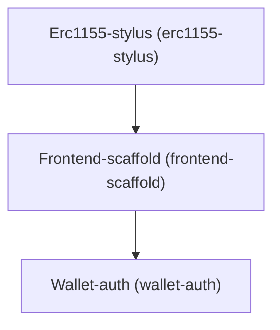

# Architecture

## Dependency Graph

```mermaid
graph TD
  477fa7ff["Erc1155-stylus (erc1155-stylus)"]
  d8e89ce6["Frontend-scaffold (frontend-scaffold)"]
  a92d4098["Wallet-auth (wallet-auth)"]
  d8e89ce6 --> a92d4098
  477fa7ff --> d8e89ce6
```

## Execution / Implementation Order

1. **Erc1155-stylus** (`477fa7ff`)
2. **Frontend-scaffold** (`d8e89ce6`)
3. **Wallet-auth** (`a92d4098`)
