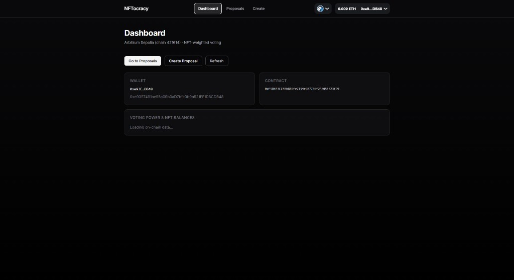
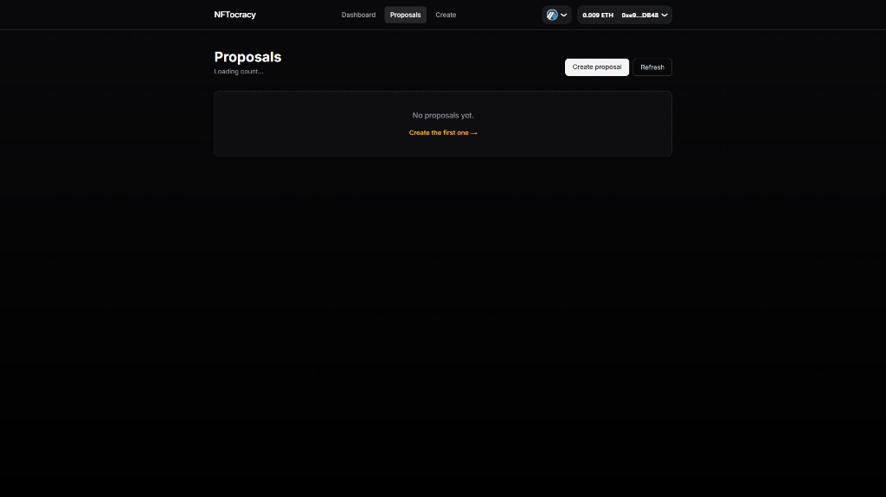
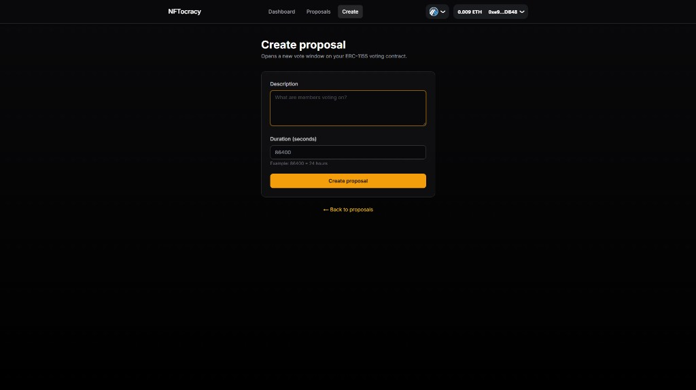
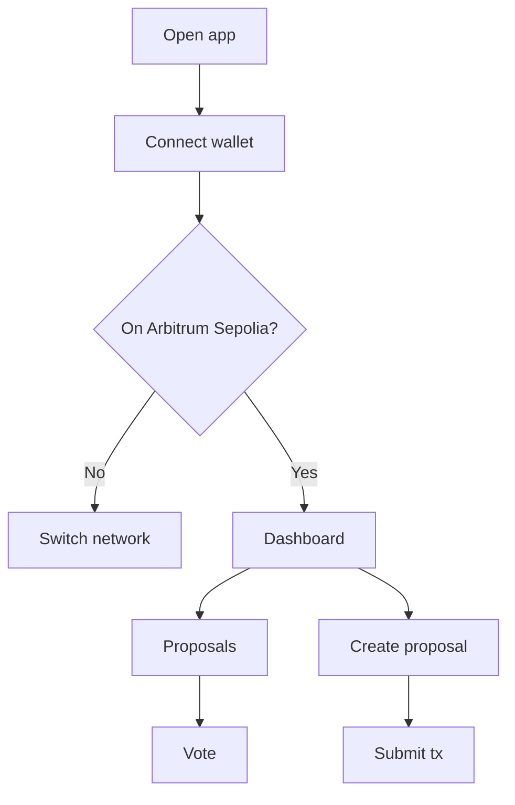
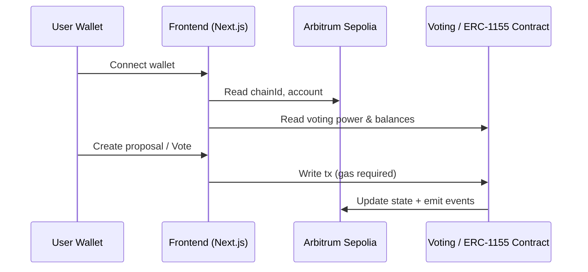

# NFTocracy (Arbitrum Sepolia)

**NFTocracy** is a Web3 governance dApp where **voting power is derived from ERC‑1155 NFT ownership**. Users connect a wallet, view proposals, create proposals, and vote — all on **Arbitrum Sepolia**.

> If the app “is not working”, it’s usually because the wallet has **insufficient Arbitrum Sepolia ETH from faucets** to pay gas. See **Troubleshooting**.

## Features

- **Wallet connect** (RainbowKit / WalletConnect)
- **Dashboard**: wallet + contract address + voting power + NFT balances
- **Proposals**: browse proposals and vote
- **Create proposal**: submit a new proposal (requires gas)

## Visual representation

### Screenshots





### UI flow



### On-chain interaction (high level)



## Tech stack

- **Next.js (App Router)**: UI + routing
- **wagmi + RainbowKit**: wallet connection & chain switching
- **Viem**: EVM primitives (via wagmi)
- **Arbitrum Sepolia**: target chain

## Repo structure

```text
nftocracy-dapp/
  apps/
    web/                      # Next.js dApp (install dependencies here)
      src/app/                # / (dashboard), /proposals, /create
      src/components/         # UI components (nav, etc.)
      src/hooks/              # useContract hook(s)
      src/lib/                # contract config/helpers
  contracts/                  # (optional) contract workspace
  docs/                       # docs + screenshots
  README.md
```

## Environment variables

This project uses a **public client-side** Next.js env pattern for addresses / ids, and keeps secrets local.

From `apps/web/`:

```bash
cp .env.example .env
```

Then set (as needed by your deployment):

- **`NEXT_PUBLIC_WALLETCONNECT_PROJECT_ID`**: required for wallet connect
- **`NEXT_PUBLIC_CONTRACT_ADDRESS`**: governance/voting contract address (if used in your build)
- **`NEXT_PUBLIC_ERC1155_ADDRESS`**: ERC‑1155 contract used to compute balances/voting power (if used in your build)

### Secret safety (.env)

- `.env` is **ignored by git** (so your private key stays private).
- If a private key was ever committed in the past, **rotate it immediately** (assume it’s compromised).

## Local development

### Prerequisites

- **Node.js 18+**
- **npm**

### Install dependencies

```bash
cd apps/web
npm install
```

### Run the app

```bash
cd apps/web
npm run dev
```

Open `http://localhost:3000`.

## Why it may not be working (Troubleshooting)

### 1) Insufficient faucet funds (most common)

**What happens**

- You can often **view** pages (reads), but **create/vote fails** (writes).
- Wallet shows errors like **“insufficient funds for gas”**.

**Why**

- Arbitrum Sepolia requires **test ETH** for gas.
- Faucets can be **rate-limited**, **empty**, or provide too little for repeated transactions.

**How to fix**

- Get more **Arbitrum Sepolia ETH** from a faucet (try multiple; availability changes).
- Wait for faucet limits to reset.
- Use a different wallet address if a faucet enforces per-address limits.

### 2) Wrong network

**Fix**: Switch your wallet to **Arbitrum Sepolia** (the app also provides a switch action).

### 3) Missing / incorrect env configuration

**Fix**: Ensure `apps/web/.env` exists and includes `NEXT_PUBLIC_WALLETCONNECT_PROJECT_ID` and the correct contract address variables.

### 4) Wrong contract address / contract not deployed

**Fix**: Confirm your contract address is deployed on **Arbitrum Sepolia** and matches the ABI expected by the frontend.

## License

MIT

---

Initial scaffold generated with [[N]skills](https://www.nskills.xyz).
